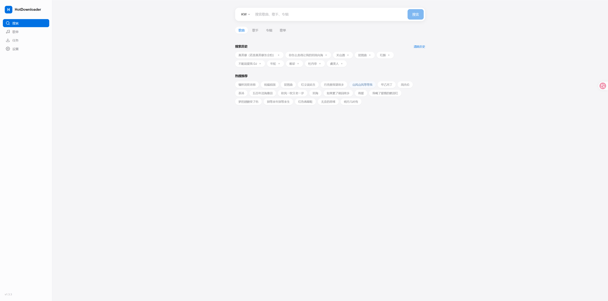
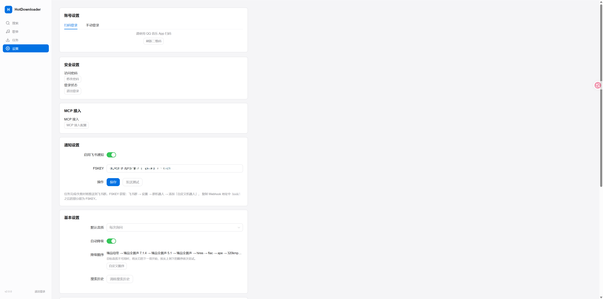
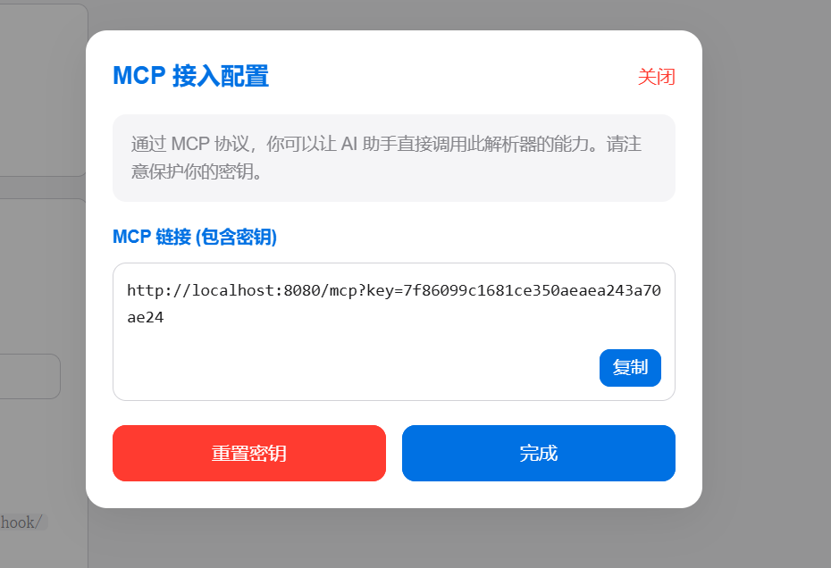
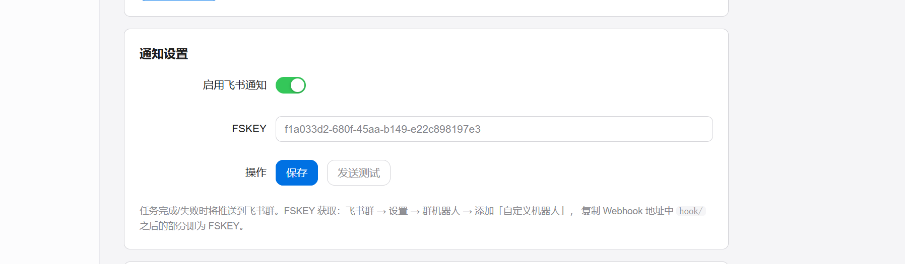

# 🎵 HotDownloader-docker

> 基于原项目 [lerdb/HotDownloader](https://github.com/lerdb/HotDownloader)
> 保留上游共享 Rust 下载核心与 Vue 3 前端，**Docker 部署**。


---

## 🏗️ 架构（单镜像 / 单容器）

Rust 服务同时托管 Web 页面与 API，浏览器只访问一个端口，无需 nginx，也无需分别部署 web / server。

```
                   浏览器
                      │ HTTP
                      ▼
        ┌──────────────────────────────────┐
        │  HotDownloader（单容器 :8787）     │
        │                                  │
        │  Rust 服务（crates/hotdownloader-server）
        │    ├── /             → Web 静态资源 (dist)
        │    ├── /api/music/*  → 搜索/歌单/专辑/歌手/歌词
        │    ├── /api/tasks*   → 任务创建/暂停/恢复/删除/重试
        │    ├── /api/settings → 设置（字段级合并）
        │    ├── /api/login/*  → 扫码/手动登录
        │    ├── /api/events   → SSE 任务/设置实时推送
        │    └── /healthz      → 健康检查
        │                                  │
        │  共享核心（crates/hotdownloader-core）│
        │    · 下载引擎（并发/断点续传/降级）  │
        │    · 平台实现       │
        └──────────────────────────────────┘
                      │
                      ▼
                 /data  /downloads
```

- **后端**：`crates/hotdownloader-core`（共享核心）+ `crates/hotdownloader-server`（HTTP/SSE 服务），与上游 v2.0.0 保持一致。
- **前端**：上游 v2.0.0 界面，风格浅色主题（`src/style.css`、`src/config/theme.ts`、`src/composables/useAppTheme.ts`、`src/components/NavLayout.vue`）。
- **访问认证**：对外监听时必须设置用户名密码或令牌（见下）。

---
| 首页 | 设置 | MCP | 通知 |
| --- | --- | --- | --- |
|||||
---

## 🚀 Docker 部署（推荐）

前置要求：Docker ≥ 24、Docker Compose v2。

### 1. 获取源码

```bash
git clone https://github.com/adaier1/hotdownloaderdocker.git
cd hotdownloaderdocker
```

### 2. 登录凭据

**默认账号：`admin` / `admin123`**。登录后可在 **设置 → 安全设置 → 修改密码** 中修改，
结果保存到 `/data/auth.json`，重启后仍然有效。

### 3. Compose

```bash
services:
  hotdownloader:
    image: ghcr.io/adaier1/hotdownloaderdocker:latest
    container_name: hotdownloader
    restart: unless-stopped

    ports:
      - "8080:8787"

    environment:
      HOTDOWNLOADER_BIND: "0.0.0.0:8787"
      HOTDOWNLOADER_DATA_DIR: "/data"
      HOTDOWNLOADER_WEB_DIR: "/app/dist"
      HOTDOWNLOADER_DOWNLOAD_DIR: "/downloads"

      AUTH_USERNAME: "admin"
      AUTH_PASSWORD: "admin123"

      TZ: "Asia/Shanghai"
      RUST_LOG: "info"

    volumes:
      - ./data:/data
      - ./downloads:/downloads
```

### 4. 访问

打开浏览器访问 **http://<主机IP>:8080**，使用默认账号 **`admin` / `admin123`**

### 环境变量

| 变量 | 默认值 | 说明 |
| --- | --- | --- |
| `HOTDOWNLOADER_BIND` | `0.0.0.0:8787` | 服务监听地址（容器内） |
| `HOTDOWNLOADER_DATA_DIR` | `/data` | 数据目录（任务/设置/凭据） |
| `HOTDOWNLOADER_WEB_DIR` | `/app/dist` | Web 静态资源目录 |
| `HOTDOWNLOADER_DOWNLOAD_DIR` | `/data/downloads` | 音乐下载目录（compose 中设为 `/downloads`） |
| `AUTH_USERNAME` / `AUTH_PASSWORD` | `admin` / `admin123` | 初始用户名密码（仅 `auth.json` 不存在时生效） |
| `HOTDOWNLOADER_TOKEN` | 空 | 令牌认证（≥16 字符，与用户名密码二选一） |
| `RUST_LOG` | `info` | 日志级别 |
| `WEB_PORT` | `8080` | 宿主机端口（compose） |
| `DATA_PATH` | `./data` | 宿主机数据目录（compose） |
| `DOWNLOAD_PATH` | `./downloads` | 宿主机下载目录（compose） |
| `TZ` | `Asia/Shanghai` | 时区（compose） |

### 持久化文件

| 路径 | 内容 |
| --- | --- |
| `/data/settings.json` | 用户设置 |
| `/data/tasks.json` | 下载任务 |
| `/data/auth.json` | 访问账号密码（界面修改密码后写入） |
| `/data/mcp.json` | MCP 接入密钥（设置页可重置） |
| `/data/notify.json` | 通知配置（飞书 FSKEY） |
| `/data/qq-credentials.json` | QQ 音乐登录凭据 |
| `/downloads/` | 下载的音乐文件 |

> 从旧版 Web 版（axum `/api/invoke`）升级：旧 `/data/data.json` 不会自动读取。可将其中的 `settings`、`tasks` 字段分别写成 `settings.json`、`tasks.json`（旧任务记录字段与 v2.0.0 兼容）。搜索历史为浏览器本地数据，存于 `localStorage`。

---

## 🤖 MCP（Model Context Protocol）

服务在**同一个端口**上额外提供 MCP Streamable HTTP 入口，供支持 MCP 的 AI 客户端调用；它独立于原有 Web/API，不影响既有功能、Docker 单镜像与上游核心。

- 端点：`POST /mcp`（JSON-RPC 2.0；通知类消息返回 202，其它方法返回 405）
- 设置页：**设置 → MCP 接入 → MCP 接入配置**，可查看/复制带密钥的完整链接并重置密钥（密钥存于 `/data/mcp.json`）
- 认证：二选一
  - URL 携带密钥：`http://<主机IP>:8080/mcp?key=<密钥>`
  - 请求头：`Authorization: Basic base64(用户名:密码)`，或 `Authorization: Bearer <HOTDOWNLOADER_TOKEN>`（令牌模式）

提供的工具（共 22 个）：

- 搜索：`search_songs`、`search_albums`、`search_artists`、`search_playlists`、`fetch_album_songs`、`fetch_artist_songs`、`fetch_artist_albums`、`fetch_playlist_songs`、`fetch_hot_keywords`、`fetch_suggestions`、`get_lyric_by_id`
- 任务：`list_tasks`、`create_download_task`、`pause_task`、`resume_task`、`retry_task`、`remove_task`、`remove_tasks`
- 设置：`get_settings`、`patch_settings`、`get_default_download_dir`、`get_login_status`

客户端配置示例（远程 HTTP，推荐直接用设置页生成带密钥的链接）：

```json
{
  "mcpServers": {
    "hotdownloader": {
      "type": "http",
      "url": "http://<主机IP>:8080/mcp?key=<设置页中的密钥>"
    }
  }
}
```

也可用请求头方式（将 `用户名:密码` 做 Base64）：

```json
{
  "mcpServers": {
    "hotdownloader": {
      "type": "http",
      "url": "http://<主机IP>:8080/mcp",
      "headers": { "Authorization": "Basic <base64(用户名:密码)>" }
    }
  }
}
```

---

## 🔔 通知设置（飞书机器人）

在 **设置 → 通知设置** 中配置：

- **启用飞书通知**：开关，开启后任务完成/失败时推送。
- **FSKEY**：飞书自定义机器人的 FSKEY（也可直接粘贴完整 Webhook 地址）。
- **发送测试**：保存配置并立即发送一条测试消息，用于验证。

获取 FSKEY：飞书群 → 设置 → 群机器人 → 添加「自定义机器人」，Webhook 形如
`https://open.feishu.cn/open-apis/bot/v2/hook/<FSKEY>`，其中 `<FSKEY>` 即所需值。

---

## 🛠️ 本地开发

```bash
# 1) 启动独立服务（默认监听 127.0.0.1:8787）
HOTDOWNLOADER_BIND=0.0.0.0:8787 \
HOTDOWNLOADER_DATA_DIR=/tmp/hd-data \
HOTDOWNLOADER_WEB_DIR=./dist \
cargo run --manifest-path crates/hotdownloader-server/Cargo.toml

# 2) 启动前端开发服务器（vite 会把 /api 代理到服务）
npm install
npm run dev
```

---


## 📄 许可证

本项目基于 [Apache License 2.0](LICENSE) 开源，第三方组件许可见 `NOTICE` 与 `THIRD_PARTY_LICENSES.txt`。

---

## ⚠️ 免责声明

**HotDownloader 仅用于学习和研究目的。** 用户需自行承担使用本软件所带来的法律责任。
请确保你下载的音乐文件拥有合法的使用权，遵守相关音乐平台的版权规定。本项目开发者不对任何侵权行为负责。
